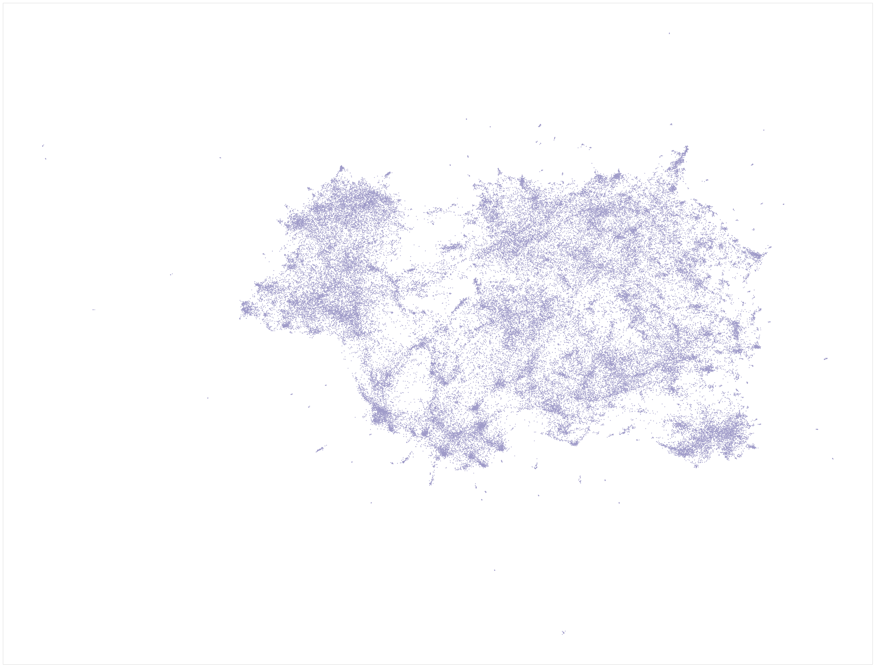
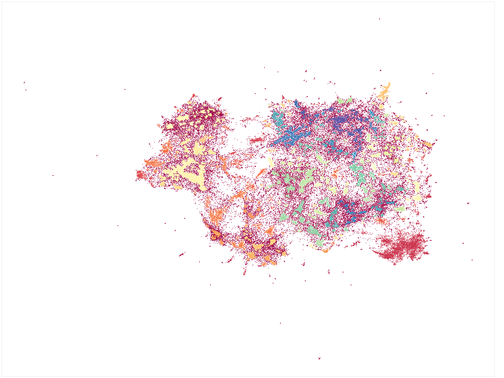
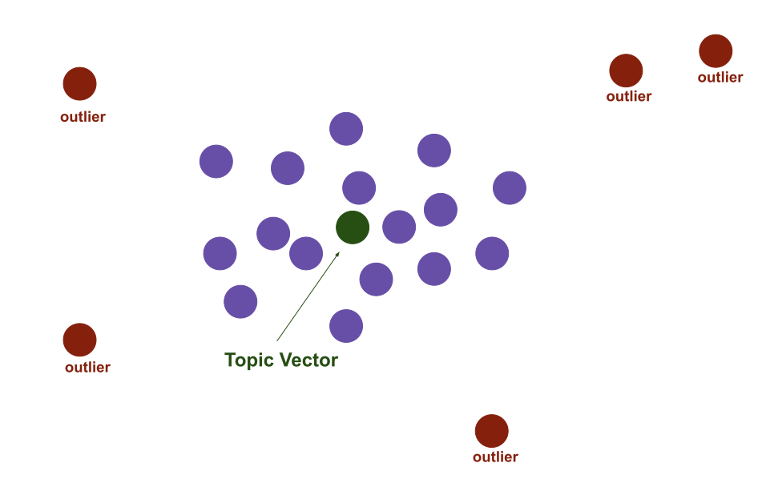
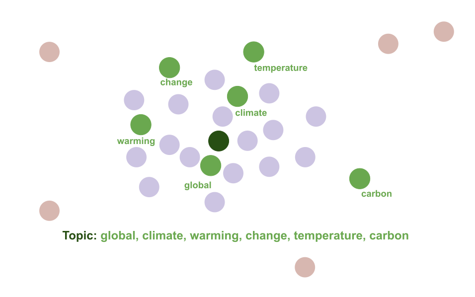

Top2Vec
=======

Topic2Vector is an algorithm for topic modeling. It automatically detects topics present in text
and generates jointly embedded topic, document and word vectors. Once you train the Top2Vec model 
you can:
* Get number of detected topics.
* Get topics.
* Search topics by keywords.
* Search documents by topic.
* Find similar words.
* Find similar documents.

Benefits
--------
1. Automatically finds number of topics.
2. No stop words required.
3. No need for stemming/lemmatizing.
4. Works on short text.
5. Creates jointly embedded topic, document, and word vectors. 
6. Has search functions built in.

How does it work?
-----------------

The assumption the algorithm makes is that many semantically similar documents
are indicative of an underlying topic. The first step is to create a joint embedding of 
document and word vectors. Once documents and words are embedded in a vector 
space the goal of the algorithm is to find dense clusters of documents, then identify which 
words attracted those documents together. Each dense area is a topic and the words that
attracted the documents to the dense area are the topic words.

### The Algorithm:

**1. Create jointly embedded document and word vectors using [Doc2Vec](https://radimrehurek.com/gensim/models/doc2vec.html).**
>Documents will be placed close to other similar documents and close to the most distinguishing words.


**2. Create lower dimensional embedding of document vectors using [UMAP](https://github.com/lmcinnes/umap).**
>Document vectors in high dimensional space are very sparse, dimension reduction helps for finding dense areas. Each point is a document vector.



**3. Find dense areas of documents using [HDBSCAN](https://github.com/scikit-learn-contrib/hdbscan).**
>The colored areas are the dense areas of documents. Red points are outliers that do not belong to a specific cluster.



**4. For each dense area calculate the centroid of document vectors in original dimension, this is the topic vector.**
>The red points are outlier documents and do not get used for calculating the topic vector. The purple points are the document vectors that belong to a dense area, from which the topic vector is calculated. 



**5. Find n-closest word vectors to the resulting topic vector**
>The closest word vectors in order of proximity become the topic words. 



Installation
------------

The easy way to install Top2Vec is:

    pip install top2vec


Usage
-----

```python

from top2vec import Top2Vec

model = Top2Vec(documents)
```
Parameters:

  * ``documents``: Input corpus, should be a list of strings.
  
  * ``speed``: This parameter will determine how fast the model takes to train. 
    The 'fast-learn' option is the fastest and will generate the lowest quality
    vectors. The 'learn' option will learn better quality vectors but take a longer
    time to train. The 'deep-learn' option will learn the best quality vectors but 
    will take significant time to train.  
    
  * ``workers``: The amount of worker threads to be used in training the model. Larger
    amount will lead to faster training.
